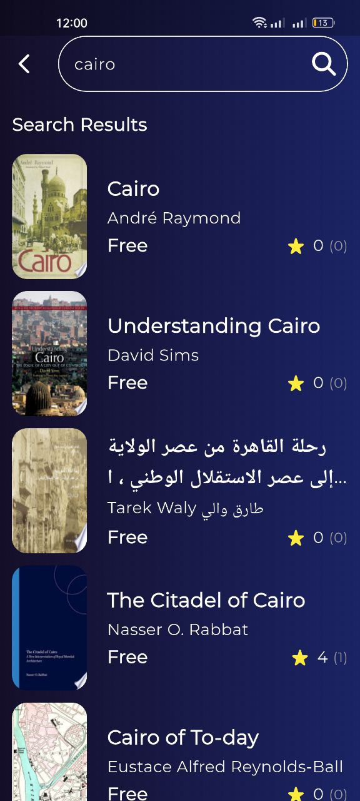
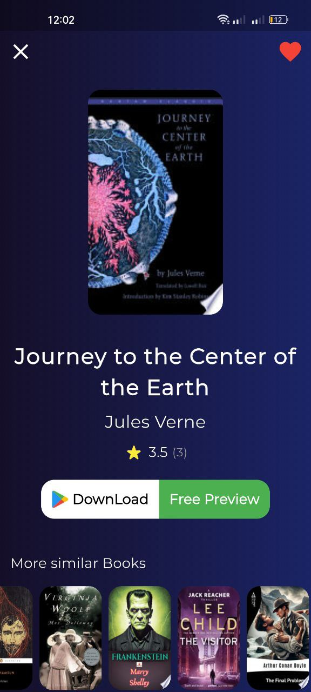

# 📚 Bookly App

A Flutter application for browsing and searching books using the **Google Books API**.  
Built with **MVVM architecture** and **Cubit (Bloc)** for state management, following clean code principles.

---

## 🚀 Features

- 🔍 Search for books by title
- 🆕 Browse the latest books
- 📖 View detailed information about each book
- ❤️ Add and remove books from favorites
- 💾 Save favorite books locally
- ▶️ Quick preview of books or download them directly from Google Play Books
- ⚡ Smooth and responsive UI

---

## 🧱 Architecture & Tech Stack

- **MVVM Architecture**
- **Cubit (Bloc State Management)**
- **Hive (Local Data Base)**
- **Google Books API**
- **REST APIs**
- **Clean Architecture**

---

## 📸 App Screenshots

| Splash | Loading | Home |
|------|---------|--------|
|  |  |  |
| Search | Details | Favorites |
|  |  |  |
